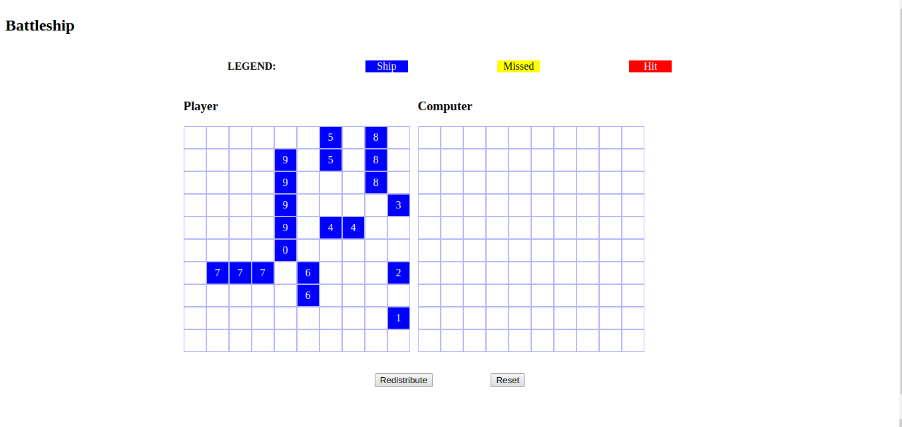

# Battleship

> implement the classic game **Battleship**

Battleship (also Battleships or Sea Battle[1]) is a strategy type guessing game for two players. It is played on ruled grids (paper or board) on which each player's fleet of ships (including battleships) are marked. The locations of the fleets are concealed from the other player. Players alternate turns calling "shots" at the other player's ships, and the objective of the game is to destroy the opposing player's fleet.

A full description of the project can be found [here](https://www.theodinproject.com/courses/javascript/lessons/battleship)

## Built With

- HTML5
- CSS3
- Javascript
- Webpack

## Getting Started

### Prerequisites

You need to have these softwares and tools installed

- Node.js
- Yarn / NPM

### Setup

To get a local copy up and running follow these simple example steps.

- Clone the repository `git clone https://github.com/maelfosso/microverse_js_battleshp`
- Change your current directory `cd microverse_js_battleshp`
- Install all the dependencies `yarn install`
- Run either `yarn build` or `npm build`
- Launch the app `yarn launch`

## Authors

👤 **Mael FOSSO**

- GitHub: [@maelfosso](https://github.com/maelfosso)
- Twitter: [@maelfosso](https://twitter.com/maelfosso)
- LinkedIn: [LinkedIn](https://www.linkedin.com/in/mael-fosso-650b6346/)

## 🤝 Contributing

Contributions, issues, and feature requests are welcome!

Feel free to check the [issues page](issues/).

## Show your support

Give a ⭐️ if you like this project!

## 📝 License

This project is [MIT](lic.url) licensed.
